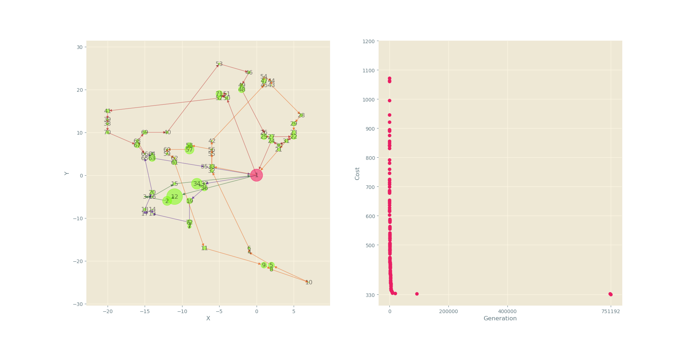

# cvrp-genetic [](https://travis-ci.com/slsyy/cvrp-genetic)

## How to run

```bash
cargo build --release
./target/release/cvrp-genetic data-sets/F-n45-k4.json 100 | ./parse_results.py
```

## Requirements

* Rust and Cargo: install stable toolchain via https://github.com/rust-lang/rustup.rs
* Python3: install dependecies using ```pip3 install -r requirements.txt``` command

## Examples results

F-n45-k4.vrp problem:


F-n72-k4.vrp problem:


F-n135-k7.vrp problem:


